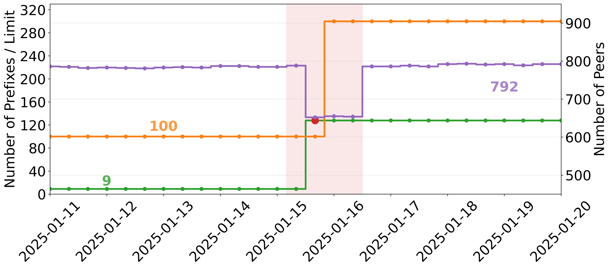

# The Circuit Breaker That Cried Wolf: Measuring BGP Maximum-Prefix Exceedance and Connectivity Impact

This repository contains the public version of the code for our work presented at the [2026 ACM Internet Measurement Conference (IMC '26)](https://conferences.sigcomm.org/imc/2026/), October 12–16, 2026, Karlsruhe, Germany.

[](LICENSE)
[](https://doi.org/10.1145/3777912.3839785)
[](https://conferences.sigcomm.org/imc/2026/)

<table>
<tr>
<td valign="top" width="55%">

**Abstract.** The BGP maximum-prefix limit serves as a network circuit breaker, tearing
down sessions when announcements exceed a configured threshold. Despite its operational
significance, little is known empirically about how accurately these limits reflect
reality, how often they are exceeded, or what connectivity impact results from their
exceedance. We present a first large-scale measurement study of BGP maximum-prefix limits
in the wild, combining 12 months of RIPE RIS snapshots with PeeringDB metadata and CAIDA
AS Rank data. Only 32.49% of RIS-visible ASes appear in PeeringDB, and 21–27% of recent
limit fields carry a value of zero, indicating no declared limit; after filtering for
recency and non-zero limits, 14,973 ASes form our analytical dataset. Among these, 14.55%
(IPv4) and 11.24% (IPv6) exceed their declared limit intermittently, and 2.15% and 2.32%
do so in every observed snapshot. These exceedances are driven by organic growth, such as
new space acquisition or deaggregation, yet the mechanism responds identically to a route
leak: Tier-1 and Major peers account for 18.4% of IPv4 lost sessions despite representing
roughly 0.1% of all ASes. Based on our findings, we offer recommendations for operators
and IXPs and call for renewed IETF standardization of dynamic limit negotiation.

</td>
<td valign="top" width="45%">



<sub>A deaggregation pushes AS44901 (BelCloud)'s announced prefix count past its PeeringDB maximum-prefix limit (the circuit breaker); peers drop, the operator responds by raising the limit, and peering then recovers. (Figure 1 in the paper.)</sub>

</td>
</tr>
</table>

## Repository layout

```
.
├── settings.json        # configuration: date range, data paths (relative), collectors, Tier-1 list
├── requirements.txt     # Python dependencies (pinned)
├── notebooks/           # the pipeline + analysis (primary, runnable form)
├── scripts/             # minimal helpers: data fetch + long-running jobs
├── images/              # final figure PDFs from the paper
└── data/                # NOT in git — skeleton only; see each NOTE.md
    ├── raw/             # fetched by the scripts (RIBs, updates, PeeringDB, CAIDA)
    └── processed/       # regenerated by the notebooks (visibility, peers, events, numbers)
```

Data is **not** shipped: raw sources are large and re-downloadable, and processed
artifacts are regenerated by the code (single source of truth). Every `data/` subfolder
has a `NOTE.md` explaining what it holds and which step produces it.

## Setup

```bash
python3 -m venv .venv && source .venv/bin/activate
pip install -r requirements.txt
```

Requires Python 3.12+. MRT parsing uses [bgpkit](https://bgpkit.com/) via `pybgpkit-parser`.

## Configuration

All paths and parameters live in `settings.json` (paths are relative to the repo root,
so the pipeline reads, writes, and saves plots inside the cloned tree). Key fields:
`START_DATE`/`END_DATE`, `DATA_DIR`, `IMAGE_DIR`, `N_PROCESSES`, the 23 RIS `COLLECTORS`,
and the authoritative `TIER1` AS list.

## Reproducibility pipeline

Numbered stages run in order. Notebooks are the runnable/readable form; a few heavy stages
also ship a script (same number) for long unattended / `tmux` runs.

| # | Step | File(s) | Produces |
|---|------|---------|----------|
| 00 | Download RIBs | `scripts/00-Download_RIBs.py` | raw RIB snapshots |
| 01 | Download PeeringDB | `scripts/01-Download_PeeringDB.py` | raw PeeringDB dumps |
| 02 | Parse PeeringDB | `notebooks/02-Parse_PeeringDB.ipynb` | prefix-limit table |
| 03 | Parse RIBs — originated | `03-Parse_RIBs_originated` (.py/.ipynb) | per-AS originated prefixes |
| 04 | Parse RIBs — announced | `04-Parse_RIBs_announcement` (.py/.ipynb) | per-AS announced prefixes |
| 05–06 | Originated high-visibility (+ timeseries) | `05-Compute_originated_visibility`, `06-Timeseries_originated_visibility` | visibility datasets |
| 07–08 | Announced high-visibility (+ timeseries) | `07-Compute_announced_visibility`, `08-Timeseries_announced_visibility` | visibility datasets |
| 09–10 | Peer graphs + per-AS peer timeseries | `09-Compute_Peer_Graphs`, `10-Compute_Peer_Timeseries` | `df_peers` |
| 11 | PeeringDB coverage & staleness | `notebooks/11-PeeringDB_Stats.ipynb` | Figs 2–5, Table 3 |
| 12 | Exceedance analysis | `notebooks/12-Exceedance_Analysis.ipynb` | Figs 6, 7, 12, Table 4 |
| 13 | Impact events + lost-peer rank | `notebooks/13-Impact_Events.ipynb` | Figs 8, 9, Table 5, event sets |
| 14 | Visibility-threshold sensitivity | `notebooks/14-Sensitivity_Analysis.ipynb` | Tables 2, 7 |
| 15 | Event classification (cause × persistence) | `notebooks/15-Event_Classification.ipynb` | Table 9 |
| 16 | Root cause: deaggregation vs. new space | `notebooks/16-Root_Cause.ipynb` | Fig 11 |
| 17–18 | Case-study updates: fetch + extract | `scripts/17-Fetch_Case_Updates.py`, `scripts/18-Extract_Case_Updates.py` | case replay inputs |
| 19–20 | Case-study plots (RIB + 5-min zoom) | `notebooks/19-Case_Study_RIB_Plots.ipynb`, `notebooks/20-Case_Study_Zoom_Plots.ipynb` | Fig 1, Fig 10 |

CAIDA AS Rank (`data/raw/AS_rank/asrank-download.py`) feeds the rank-based steps (13, 12);
`scripts/case_studies.py` holds the four case definitions imported by steps 17–20.

## Reproducing results

- **Inspect only** — browse the notebooks and the shipped figure PDFs in `images/`. No compute.
- **Full reproduction** — run the pipeline in order from the raw sources (nb0 → … → nb13).
  This downloads hundreds of GB and takes substantial compute; run it in stages.
- **Partial** — any stage runs once its inputs exist (e.g. the classification notebooks
  once the event sets from stage 11 are present).

Raw RIPE RIS RIBs (~3.4 TB across the study) and case-study updates (~144 GB) are not
redistributed; they are publicly available from [RIPE RIS](https://ris.ripe.net/) and
fetched by the scripts.

## Citation

```bibtex
@inproceedings{martinez2026circuitbreaker,
  author    = {Mart\'inez-Durive, Orlando E. and Chariton, Antonis and Fiore, Marco},
  title     = {The Circuit Breaker That Cried Wolf: Measuring BGP Maximum-Prefix Exceedance and Connectivity Impact},
  booktitle = {Proceedings of the 2026 ACM Internet Measurement Conference (IMC '26)},
  year      = {2026},
  location  = {Karlsruhe, Germany},
  publisher = {Association for Computing Machinery},
  address   = {New York, NY, USA},
  doi       = {10.1145/3777912.3839785}
}
```

## License

Released under the [Creative Commons Attribution 4.0 International (CC BY 4.0)](LICENSE)
license.
